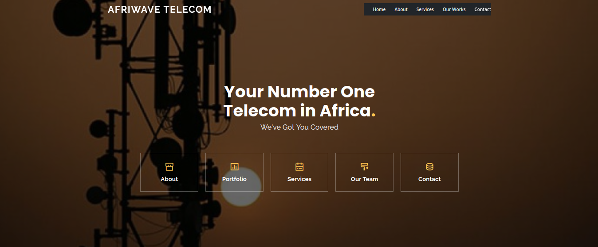
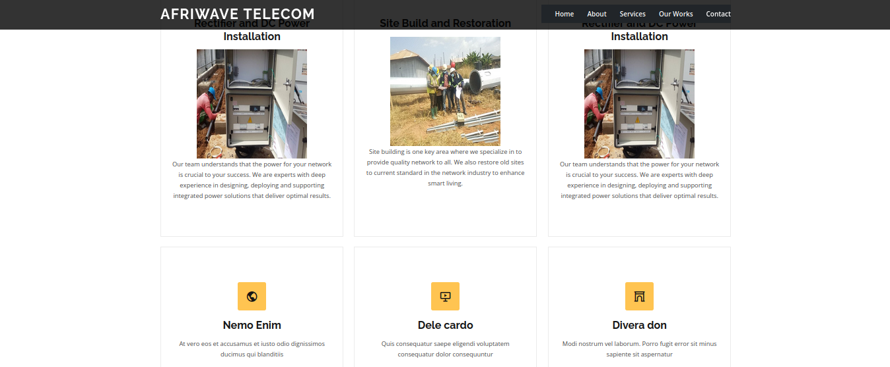
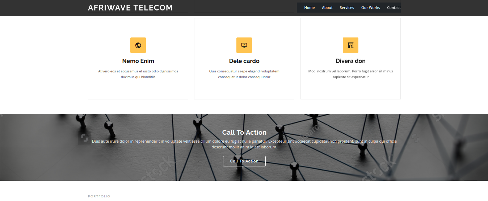
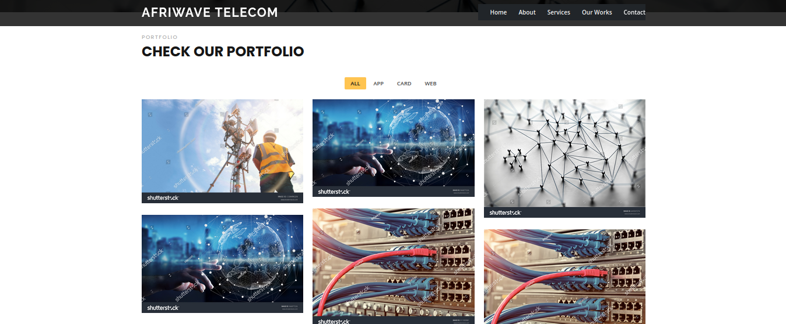
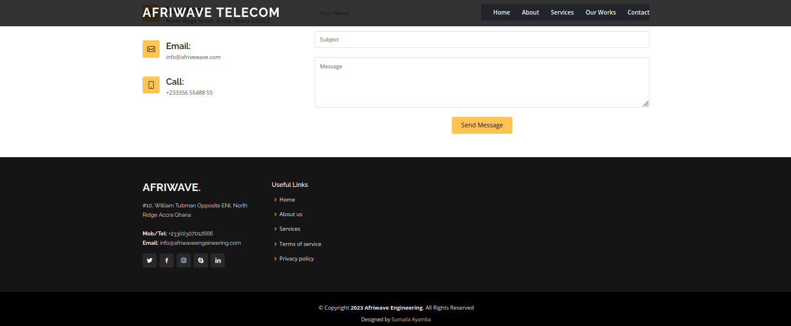

# Afriwave Telecom Website

Welcome to the Afriwave Telecom website repository! This project is aimed at building a responsive, user-friendly website that showcases the services, products, and values of Afriwave Telecom. Below is an overview of the project and how to get started.
Table of Contents

### Project Overview
    Features
    Technologies Used
    Installation
    Usage
    Contributing
    License
    Contact

### Project Overview

Afriwave Telecom is a leading telecom provider in Africa, offering a wide range of services including mobile communication, broadband, and digital solutions. This website serves as a digital front for Afriwave Telecom, providing customers with access to information about our services, customer support, and latest updates.
Features

    Responsive Design: The website is fully responsive, ensuring a seamless experience across all devices.
    Service Pages: Detailed pages for each service offered by Afriwave Telecom.
    Customer Support: Integrated customer support section with contact forms and FAQs.
    News & Updates: Latest news and updates about Afriwave Telecom.
    Multilingual Support: The website supports multiple languages to cater to a diverse audience.

Technologies Used

    Frontend:
        HTML5, CSS3, JavaScript
        Bootstrap for responsive design

Usage

The website is structured to provide easy navigation for users to find information about Afriwave Telecom’s services. Use the navbar to explore different sections like Services, Support, News, and Contact.
Contributing

We welcome contributions to the Afriwave Telecom website project! To contribute:

    Fork the repository.
    Create a new branch (git checkout -b feature-branch).
    Make your changes and commit them (git commit -m 'Add new feature').
    Push to the branch (git push origin feature-branch).
    Open a pull request.

Please make sure your code follows our coding guidelines.
License

This project is licensed under the MIT License - see the LICENSE file for details.
Contact

For any questions or inquiries, please contact us at info@afriwave.com

